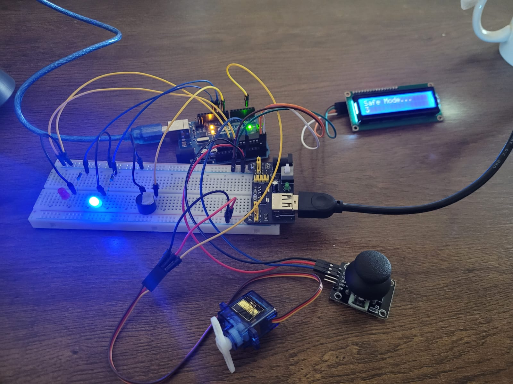
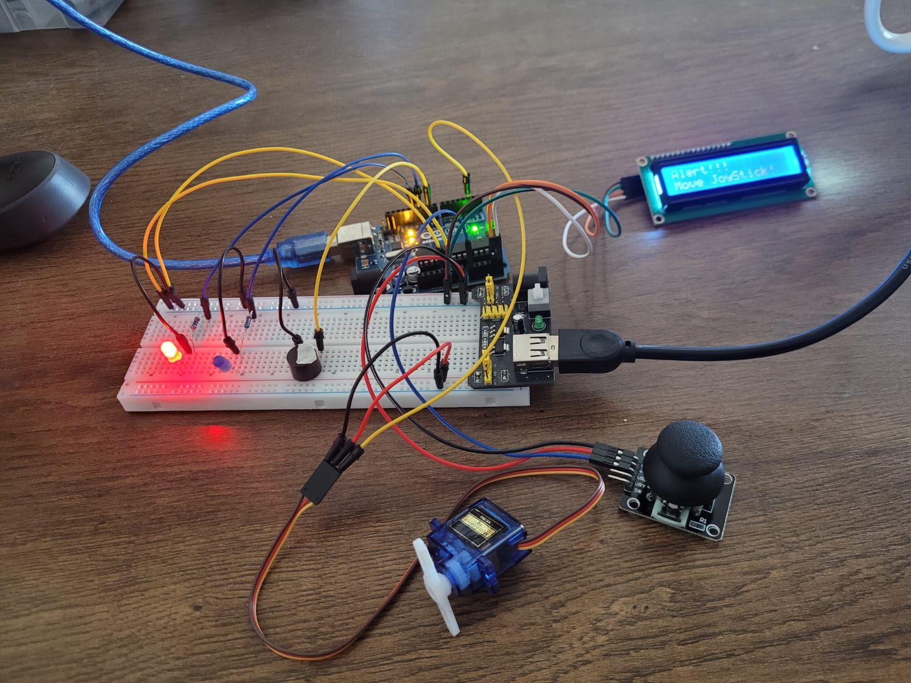
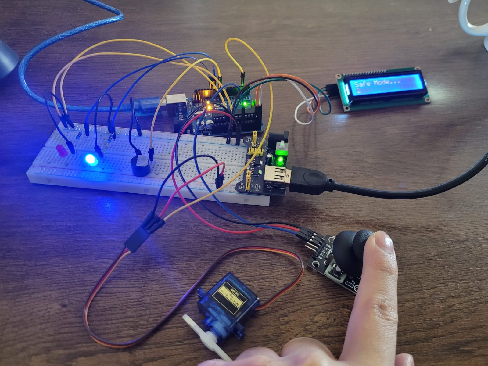

# Arduino_Joystick_Inactivity_Detection_System


# Description:
This project uses an Arduino, joystick, servo motor, LCD display, buzzer, red and blue LEDs to monitor joystick activity and detect prolonged inactivity.

The system starts in Safe Mode, where:

The joystick can move freely and controls the servo motor.

The LCD displays "Safe Mode".

The blue LED remains ON to indicate normal operation.


The program continuously checks if the joystick or the servo has been inactive for more than 10 seconds.

---

⚠If inactivity is detected:

The LCD displays "Inactivity Detected!"

The buzzer sounds an alert tone

The red LED turns ON

The system enters Alert Mode

---

To return to Safe Mode:

Simply move the joystick again

The system resets the timer

The LCD shows "Safe Mode" again

The blue LED turns ON

The red LED and buzzer turn OFF


This project is perfect for creating idle detection or security lockout systems, and is a great example of combining timing, input tracking, and visual/audio feedback in Arduino.


# Pictures:





# Code Below:
```cpp
#include <LiquidCrystal_I2C.h>
#include <Servo.h>


Servo servo;
LiquidCrystal_I2C lcd(0x27, 16, 2);


byte blueLED = 11;
byte redLED = 12;
byte buzzer = 9;
int pinX = A0;
unsigned long lastTime = 0;

int xRead;
byte angle;
int lastAngle;


void setup() {
  Serial.begin(9600);
  servo.attach(2);
  lcd.init();
  lcd.backlight();
  pinMode(blueLED, OUTPUT);
  pinMode(redLED, OUTPUT);
  pinMode(buzzer, OUTPUT);
  servo.write(0);
  delay(1000);
}

void loop() {
  lcd.clear();
  xRead = analogRead(pinX);

  angle = map(xRead, 0, 1023, 0, 180);

  if ((millis() - lastTime) > 10000) {
    lcd.clear();
    lcd.setCursor(0,0);
    lcd.print("Alert!!!");
    lcd.setCursor(0,1);
    lcd.print("Inactivity detected");
    digitalWrite(redLED, HIGH);
    digitalWrite(blueLED, LOW);
    digitalWrite(buzzer, HIGH);
  }

  else{
    lcd.clear();
    lcd.setCursor(0,0);
    lcd.print("Safe Mode...");
    lcd.setCursor(0,13);
    lcd.print((millis() - lastTime) / 1000);
    digitalWrite(blueLED, HIGH);
    digitalWrite(redLED, LOW);
    digitalWrite(buzzer, LOW);
  }

  if (abs(angle - lastAngle) > 5){
    lastAngle = angle;
    lastTime = millis();
  }

  servo.write(angle);

  Serial.println((millis() - lastTime));
  Serial.println(lastTime);
  Serial.println(angle);
  Serial.println("---------------------------------");

  delay(80);
}
```
